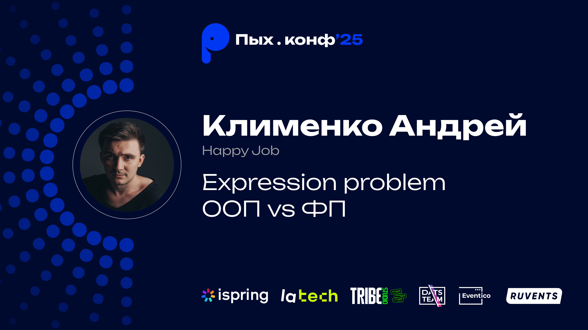
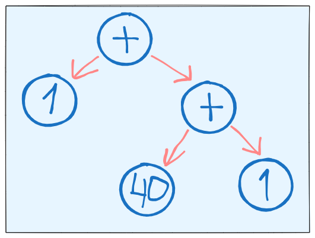
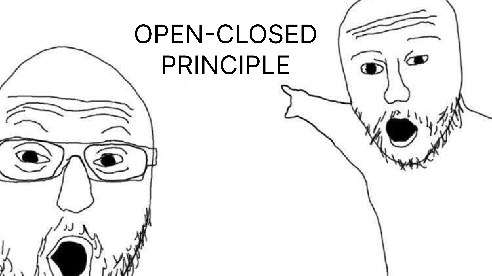
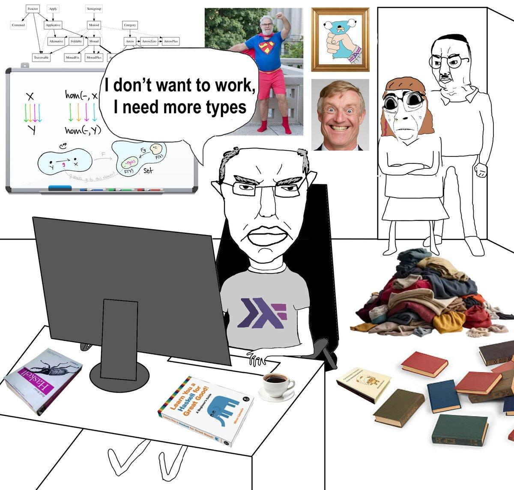
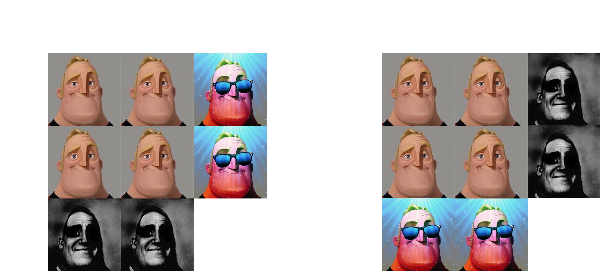
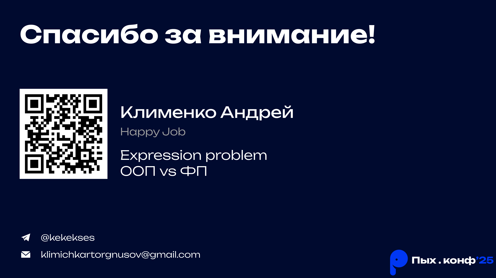

<!-- _paginate: skip -->


---


---

# Динамическая типизация не масштабируется

---

# Статическая типизация

---

<!-- _paginate: false -->


---

# Expression problem

- Добавление новых видов данных
- Добавление новых операций

---

# Добавление новых видов данных?

```php
$ast = new Add(
    new Num(1),
    new Add(
        new Num(40),
        new Num(41),
    ),
);
```



---

# Добавление новых операций?

```php
var_dump([
    'repr' => $ast->toString(),
    'optimizedRepr' => $ast->optimize()->toString(),
    'evaluated' => $ast->evaluate(),
]);
```

---

# Решение

- Сохранение type safety
- Модульность расширений
- Отсутствие дублирования кода

---

# Позволим проблеме появиться

---

# Интерфейс

```php
interface Expr {
    public function evaluate(): int;
}

final readonly class Num implements Expr {/* ... */}
final readonly class Add implements Expr {/* ... */}
```

---

# Реализации

<div class="two-columns">

```php
final readonly class Num implements Expr {
    public function __construct(
        public int $value,
    ) {}

    public function evaluate(): int {
        return $this->value;
    }
}
```

```php
final readonly class Add implements Expr {
    public function __construct(
        public Expr $left, public Expr $right,
    ) {}

    public function evaluate(): int {
        return $this->left->evaluate() +
               $this->right->evaluate();
    }
}
```

</div>

---

# Пример использования

```php
$simple = new Add(
  left: new Num(1),
  right: new Num(41),
);

var_dump($simple->evaluate());

$complex = new Add(
  left: new Add(left: new Num(1), right: new Num(20)),
  right: new Add(left: new Num(20), right: new Num(1)),
);

var_dump($complex->evaluate());
```

---

# Добавим новый вариант

```php  
final readonly class Mul implements Expr {
    public function __construct(
        public Expr $left,
        public Expr $right,
    ) {}

    public function evaluate(): int {
        return $this->left->evaluate() * $this->right->evaluate();
    }
}
```

---

# Используем новый вариант

```php
$add = new Add(/* ... */);

$mul = new Mul(
    left: new Num(2),
    right: $add,
);

var_dump($mul->evaluate());
```

---



---

# А как привести к строке?

---

## Дамы и господа
У нас мажорный релиз!


---

# Instanceof

```php
function toString(Expr $e): string {
    return match (true) {
        $e instanceof Num => \sprintf('%d', $e->value),
        $e instanceof Add => \sprintf('%s + %s', toSting($e->left), toSting($e->right)),
        default => throw new \InvalidArgumentException('Not supported!');,
    };
}

// Type checked! Но падает во время выполнения.
toString(new Mul(/* ... */));
```

---

<!-- _paginate: false -->


---

# ADT

*Algebraic data types*

- Sum type
- Product type

---

# Product type

Индексированный список типов

```php
final readonly class Person {
    public function __construct(
        public string $name,
        public int $age,
    ) {}
}

/**
 * @param list{string, int} $tuple
 * @param array{name: string, age: int} $shape
 */
function productTypes(array $tuple, array $shape): void {}
```

---

# Sum type

Фиксированное множество типов

```php
/**
 * @param ( array{type: 'num', value: int}    |
 *          array{type: 'str', value: string} |
 *          array{type: 'flag', value: bool}  ) $shape
 */
function sumTypes(Num|Add|Mul $class, array $shape): void {}
```

---

# Почему algebraic

```php
enum Hour: int {
    case One = 1;
    /* ... 2, 3, 4, 5, 6, 7, 8, 9, 10, 11 ... */
    case Twelve = 12;
}

enum Period: string {
    case AM = 'am';
    case PM = 'pm';
}

final readonly class Clock {
    public function __construct(public Hour $hour, public Period $period) {}
}
```

---

# Cardinality

```
Hour = { 1, 2, 3, 4, 5, 6, 7, 8, 9, 10, 11, 12 }

Period = { 'am', 'pm' }

Clock = Hour × Period = { (1,AM), (1,PM), (2,AM), (2,PM), … ,(12,PM) }
```

---

# Sum type неудобен в PHP

Это не удобно

```php
function unionNightmare(Num|Add|Sub|Mul|Div|Eq|Lam|App...): void {}
```

Этого еще пока не завезли

```php
enum Expr {
    case Num(int $value);
    case Add(Expr $left, Expr $right);
    case Sub(Expr $left, Expr $right);
    // ...
}
```

---

# Psalm\PHPStan type alias

```php
/**
 * @phpstan-type Expr = Num | Add
 */
interface ExprT {}

final readonly class Num {/* ... */}
final readonly class Add {/* ... */}
```

---

# Psalm\PHPStan type alias

```php
/**
 * @phpstan-import-type Expr from ExprT
 */
final readonly class Usage {
    /**
     * @param Expr $expr
     */
    public function toString(mixed $expr): string {
        return match ($expr::class) {
            Num::class => '...',
            Add::class => '...',
        };
    }
}
```

---

# PHPStan sealed

```php
/** @phpstan-sealed Num | Add */
interface Expr {}

final readonly class Num implements Expr {/* ... */}
final readonly class Add implements Expr {/* ... */}

function toString(Expr $expr): string {
    // По $expr::class PHPStan не может доказать exhaustiveness
    // А вот по match (true) + instanceof может...
    return match ($expr::class) {
        Num::class => '...',
        Add::class => '...',
    };
}
```

---

# Sum type адекватного человека

- Закрытое перечисление вариантов
- Исчерпывающая обработка вариантов
- Возможность ссылаться на все по одному имени

---

# Visitor


---

# Объявление суммы

```php
/** @template T */
interface ExprVisitor {
    /** @return T */
    public function visitNum(Num $exp): mixed;

    /** @return T */
    public function visitAdd(Add $exp): mixed;
}
```

---

# Обработка любого варианта

```php
interface Expr {
    /**
     * @template T
     * @param ExprVisitor<T> $visitor
     * @return T
     */
    public function accept(ExprVisitor $visitor): mixed;
}
```

---

# Обработка конкретного варианта

```php
final readonly class Num implements Expr {
    public function __construct(
        public int $value,
    ) {}

    public function accept(ExprVisitor $visitor): mixed {
        return $visitor->visitNum($this);
    }
}
```

---

# Операции добавлять легко

```php
/** @implements ExprVisitor<int> */
enum Evaluate implements ExprVisitor {
    case Visitor;

    public function visitNum(Num $e): int {
        return $e->value;
    }

    public function visitAdd(Add $e): int {
        return $e->left->accept($this) + $e->right->accept($this);
    }
}
```

---

# Крайне легко

```php
/** @implements ExprVisitor<string> */
enum ToString implements ExprVisitor {
    case Visitor;

    public function visitNum(Num $e): string {
        return "{$e->value}";
    }

    public function visitAdd(Add $e): string {
        return "{$e->left->accept($this)} + {$e->right->accept($this)}";
    }
}
```

---

# Использование

```php
function getAnyExpr(): Expr {/* ... */}

$expr = getAnyExpr();
$evaluated = $expr->accept(Evaluator::Visitor);
$asString = $expr->accept(ToString::Visitor);

var_dump("{$asString} = {$evaluated}");
```

---

# Минусы

*Помимо одного очевидного!*

---

# Expr открыт

```php
enum FortyTwo implements Expr {
    case Instance;

    public function accept(ExprVisitor $visitor): mixed {
        static $fortyTwo = new Num(42);

        return $visitor->acceptNum($fortyTwo);
    }
}
```

---

# Instanceof

```php
enum FortyTwo implements Expr {
    case Instance;

    public function accept(ExprVisitor $visitor): mixed {
        return $visitor instanceof ExtendedEvaluator
            ? $visitor->acceptFortyTwo($this)
            : throw new \InvalidArgumentException();
    }
}

// Ошибка времени выполнения
$evaluated = FortyTwo::Instance->accept(Evaluator::Visitor);
```

---

# Type safety

---

# Добавим сравнение

```php
final readonly class IntEq implements Expr {
    public function __construct(
        public Expr $left,
        public Expr $right,
    ) {}

    public function evaluate(): int
    {
        // Born to return bool
        // Forced to return int
    }
}
```

---

# Return type слишком узкий

```php
interface Expr {
    public function evaluate(): int;
}
```

---

# Return type слишком широкий

```php
interface Expr {
    public function evaluate(): mixed;
}
```

---

# Type safety потеряна

```php
final readonly class Add implements Expr {
    public function __construct(
        public Expr $left,
        public Expr $right,
    ) {}

    public function evaluate(): int
    {
        // Binary operation "+" between mixed and mixed results in an error.
        return $this->left->evaluate() + $this->right->evaluate();
    }
}
```

---

# Бессмысленное выражение

```php
// (1 === 41) + 1

new Add(  
    new IntEq(new Num(1), new Num(41)),
    new Num(1),
);
```

---

# Абстрактный return type

```php
/**
 * @template R
 */
interface Expr {
    /**
     * @return R
     */
    public function evaluate(): mixed;
}
```

---

# Числовой литерал

```php
/** @implements Expr<int> */
final readonly class Num implements Expr {
    public function __construct(
        public int $value,
    ) {}

    public function evaluate(): int {
        return $this->value;
    }
}
```

---

# Сложение

```php
/** @implements Expr<int> */
final readonly class Add implements Expr {
    /**
     * @param Expr<int> $left
     * @param Expr<int> $right
     */
    public function __construct(
        public Expr $left,
        public Expr $right,
    ) {}

    public function evaluate(): int {
        return $this->left->evaluate() + $this->right->evaluate();
    }
}
```

---

# Сравнение

```php
/** @implements Expr<bool> */
final readonly class IntEq implements Expr {
    /**
     * @param Expr<int> $left
     * @param Expr<int> $right
     */
    public function __construct(
        public Expr $left,
        public Expr $right,
    ) {}

    public function evaluate(): bool {
        return $this->left->evaluate() === $this->right->evaluate();
    }
}
```

---

# Бессмысленное выражение невозможно

```php
// Psalm\PHPStan ругается...
new Add(
    left: new IntEq(left: new Num(1), right: new Num(41)),
    right: new Num(1),
);

// Все хорошо!
new IntEq(
    left: new Num(41),
    right: new Add(left: new Num(1), right: new Num(41)),
);
```

---

# А как быть с Visitor?

```php
/** @template R */
interface ExprVisitor {
    /** @return R */
    public function visitNum(Num $exp): mixed;

    /** @return R */
    public function visitAdd(Num $exp): mixed;

    /** @return R */
    public function visitIntEq(IntEq $exp): mixed;
}
```

---

# GADT

*Generalized ADT*

```scala 3
enum Expr[T]:
  case Num(value: Int)
    extends Expr[Int]

  case Add(left: Expr[Int], right: Expr[Int])
    extends Expr[Int]

  case IntEq(left: Expr[Int], right: Expr[Int])
    extends Expr[Boolean]
```

---

# Вывод типов в pattern match

```scala 3
def eval[T](e: Expr[T]): T = e match
  case Num(value) => value
  case Add(left, right) => eval(left) + eval(right)
  case IntEq(left, right) => eval(left) == eval(right)
```

---

# GADT Visitor

[Белая бумага](https://www.microsoft.com/en-us/research/wp-content/uploads/2016/02/gadtoop.pdf)

---

# Generalized type constraint

```csharp
public interface IExpr<T>
{
    public R Accept<R>(ExprVisitor<T, R> v);
}

public interface IExprVisitor<T, R>
{
    R VisitNum(Num e) where T : int;
    R VisitAdd(Add e) where T : int;
    R VisitIntEq(IntEq e) where T : bool;
}
```

---

# GADT Evaluator

```csharp
public class Evaluator<T> : IExprVisitor<T, T> {
    T VisitNum(Num e) where T : int =>
        e.number

    T VisitAdd(Add e) where T : int =>
        e.Left.Accept(this) + e.Right.Accept(this)

    T VisitIntEq(IntEq e) where T : bool {
        // НЕ МОЖЕМ ПЕРЕИСПОЛЬЗОВАТЬ
        var intEvaluator = new Evaluator<int>();

        return e.Left.Accept(intEvaluator) == e.Right.Accept(intEvaluator);
    }
}
```

---

# Как это должно было использоваться

```csharp
public class Add : IExpr<int> {
    /* ... */

    public R Accept<R>(ExprVisitor<int, R> v) => v.visitAdd(this);
}

IExpr<int> num = new Add /* ... */;

int val = num.Accept(new Evaluator<int>());
```

---

# Но этой фичи почти нигде нет

---

# HIGHER
# KINDED
# TYPE



---

# Type level функция

<div class="two-columns">

```scala 3
type MakeTuple[MkElem[x]] = (
    MkElem[Int],
    MkElem[String],
)

type Identity[A] = A
type ToString[A] = String

summon[MakeTuple[Identity] =:= (Int, String)]
summon[MakeTuple[ToString] =:= (String, String)]
```

```php
$makeTuple = fn ($mkElem) => [
    $mkElem(42),
    $mkElem('str'),
];

$identity = fn ($a) => $a;
$toString = fn ($a) => (string) $a;

assert($makeTuple($identity) === [42, 'str']);
assert($makeTuple($toString) === ['42', 'str']);
```

</div>

---

# Type level функция

<div class="two-columns">

```scala 3
import scala.compiletime.ops.int.+

type Mapped = Tuple.Map[
  (1, 2, 3),
  [X <: Int] =>> X + 1,
]

summon[Mapped =:= (2, 3, 4)]
```

```php
// Тоже самое, только на term level

$mapped = map(
    [1, 2, 3],
    static fn (int $x) => $x + 1,
);

assert($mapped === [2, 3, 4]);
```

</div>

---

# GADT Visitor

```scala 3
trait ExpVisitor[R[_]]:
  def visitNum(e: Num): R[Int]
  def visitAdd(e: Add): R[Int]
  def visitIntEq(e: IntEq): R[Boolean]
```

---

# Реализации

```scala 3
object Evaluator extends ExpVisitor[[x] =>> x]:
  def visitNum(e: Num): Int = ???
  def visitAdd(e: Add): Int = ???
  def visitIntEq(e: IntEq): Boolean = ???

object Stringifier extends ExpVisitor[[x] =>> String]:
  def visitNum(e: Num): String = ???
  def visitAdd(e: Add): String = ???
  def visitIntEq(e: IntEq): String = ???

object DeepClone extends ExpVisitor[[x] =>> Expr[x]]:
  def visitNum(e: Num): Expr[Int] = ???
  def visitAdd(e: Add): Expr[Int] = ???
  def visitIntEq(e: IntEq): Expr[Boolean] = ???
```

---

# Higher kinded type in PHPStan

---

<!-- _paginate: false -->


---

<!-- _paginate: false -->


---

# Безысходный код

https://github.com/klimick/highstan

---

# Однопараметрический конструктор

```php
/**
 * @template F of type-lam(x): mixed
 * @param F<int> $fa
 * @return F<int>
 */
function noop(mixed $fa): mixed {
    return $fa;
}
```

---

# Faked GADT

```php
/** @template R of type-lam(x): mixed */
interface ExprVisitor {
    /** @return R<int> */
    public function visitNum(Num $exp): mixed;

    /** @return R<int> */
    public function visitAdd(Add $exp): mixed;

    /** @return R<bool> */
    public function visitEq(IntEq $exp): mixed;
}
```

---

# Вычисление выражения

```php
/** @implements ExprVisitor<type-lam(x): x> */
enum Evaluator implements ExprVisitor {
    case Visitor;

    public function visitNum(Num $e): int { /* ... */ }

    public function visitAdd(Add $e): int { /* ... */ }

    public function visitEq(IntEq $e): bool { /* ... */ }
}
```

---

# Приведение к строке

```php
/** @implements ExprVisitor<type-lam(x): string> */
enum Stringifier implements ExprVisitor {
    case Visitor;

    public function visitNum(Num $e): string  { /* ... */ }

    public function visitAdd(Add $e): string  { /* ... */ }

    public function visitEq(IntEq $e): string  { /* ... */ }
}
```

---

# У вас должен быть выбор



---

# EP solution

---

# Initial encoding VS Final encoding

<div class="two-columns">

```php
class Num implements Expr {
    /* (int $value) */
}

class Add implements Expr {
    /* (int $l, int $r) */
}

$fortyTwo = new Add(
    new Num(1),
    new Num(41),
);
```

```php
function num(int $value): int {
    return $value;
}

function add(int $l, int $r): int {
    return $l + $r;
}

$fortyTwo = add(
    num(1),
    num(41),
);
```

</div>

---

# Final encoding

- Легко расширяется новыми вариантами
- Но имеет одну возможную интерпретацию

```php
function mul(int $l, int $r): int {
    return $l * $r;
}

$doubledFortyTwo = mul(num(2), $fortyTwo);
```

---

# Выделим семантику

```php
interface ExprSem
{
    public function num(int $value): int;

    public function add(int $left, int $right): int;
}
```

---

# Уберем конкретный тип данных

```php
/** @template TRepr */
interface ExprSem
{
    /**
     * @return TRepr
     */
    public function num(int $value): mixed;

    /** 
     * @param TRepr $left
     * @param TRepr $right
     * @return TRepr
     */
    public function add(mixed $left, mixed $right): mixed;
}
```

---

# Tagless final

```php
/** 
 * @template TRepr
 * @param ExprSem<TRepr> $exprS
 * @return TRepr
 */
function fortyTwo(ExprSem $exprS): mixed {
    return $exprS->add(
        left: $exprS->num(1),
        right: $exprS->num(41),
    );
}
```

---

# Интерпретация

<div class="two-columns">

```php
/** @implements ExprSem<int> */
enum Evaluator implements ExprSem {
    case Instance;

    public function num(int $value): mixed {
        return $value;
    }

    public function add(mixed $left, mixed $right): mixed {
        return $left + $right;
    }
}
```

```php
/** @implements ExprSem<string> */
enum Stringifier implements ExprSem {
    case Instance;

    public function num(int $value): mixed {
        return "{$value}";
    }

    public function add(mixed $left, mixed $right): mixed {
        return "({$left} + {$right})";
    }
}
```

</div>

---

# Использование

```php
/** 
 * @template TRepr
 * @param ExprSem<TRepr> $exprS
 * @return TRepr
 */
function fortyTwo(ExprSem $exprS): mixed { /* ... */ }

$evaluated = fortyTwo(Evaluator::Instance);
$asString = fortyTwo(Stringifier::Instance);

// (1 + 41) = 42
var_dump("{$asString} = {$evaluated}");
```

---

# Новый вариант

```php
/** @template TRepr */
interface MulSem {
    /** 
     * @param TRepr $left
     * @param TRepr $right
     * @return TRepr
     */
    public function mul(mixed $left, mixed $right): mixed;
}
```

---

# Новая интерпретация

<div class="two-columns">

```php
/** @implements MulSem<int> */
enum MulEvaluator implements MulSem {
    case Instance;

    public function mul(mixed $left, mixed $right): mixed {
        return $left * $right;
    }
}
```

```php
/** @implements ExprSem<string> */
enum MulStringifier implements ExprSem {
    case Instance;

    public function mul(mixed $left, mixed $right): mixed {
        return "({$left} * {$right})";
    }
}
```

</div>

---

# Старые/новые варианты совместимы

```php
/** 
 * @template TRepr
 * @param ExprSem<TRepr> $exprS
 * @param MulSem<TRepr> $mulS
 * @return TRepr
 */
function doubledFortyTwo(ExprSem $exprS, MulSem $mulS): mixed {
    return $mulS->mul(
        left: $exprS->num(2),
        right: fortyTwo($exprS),
    );
}
```

---

# Старые/новые операции совместимы

```php
/** 
 * @template TRepr
 * @param ExprSem<TRepr> $exprS
 * @param MulSem<TRepr> $mulS
 * @return TRepr
 */
function doubledFortyTwo(ExprSem $exprS, MulSem $mulS): mixed { /* ... */}

$evaluated = doubledFortyTwo(Evaluator::Instance, MulEvaluator::Instance);
$asString = doubledFortyTwo(Stringifier::Instance, MulStringifier::Instance);

// (2 * (1 + 41)) = 84
var_dump("{$asString} = {$evaluated}");
```

---

# Вы отказались от данных

И получили настоящий OPEN CLOSED! Вы можете:

- Добавлять новые варианты
- Добавлять новые операции
- Быть полностью type safe

---

# А так же

Вы потеряли:

- Instanceof
- Reflection
- Universal equality

---

<!-- _paginate: false -->


---

# Typhoon

Невозможно написать в type safe манере

```php
/**
 * @template T
 * @param Type<T> $type
 * @return JsonDecoder<T>
 */
function makeJsonDecoder(Type $type): JsonDecoder { /* ... */ }

$numbers = t::list(t::int); // <-- ЭТО GADT!
$numbersDecoder = makeJsonDecoder($numbers);

dump($numbersDecoder->decode('[1, 2, 3]'));
```

---

# Typhoon

Добавление новых вариантов типа невозможно

---

